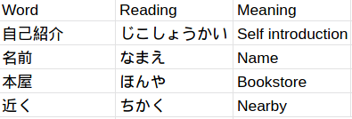

# anki helper
__Disclaimer: This project and its author(s) are not affiliated/associated Anki in any way whatsoever!__

This is a simple command line utility hat helps me make Anki decks while studying different languages, specifically Japanese.

When transcribing the meaning of a word or a kanji, etc from a textbook I found it clumsy to use the Anki app due to its interface. 
Using this I just have to make an excel/google sheets file, save it as a .csv and then run the script which is a *lot* more convenient. 

This makes some very pretty and easy to read, as well as information-dense flash cards that I have found very helpful to study with.

## Usage 
In the root directory, when you have a valid .csv file in the /data/ directory, in your terminal of choice, type:

*Note: the Deck name should be the same as the name of the .csv file in the /data/ directory. This may change but for simplicity's sake this is how it works right now.*
```bash 
ruby main.rb -c "Deck name" 
```
The .csv file can have many different layouts as the program does work around this, but here is one example of a file one might use: 

